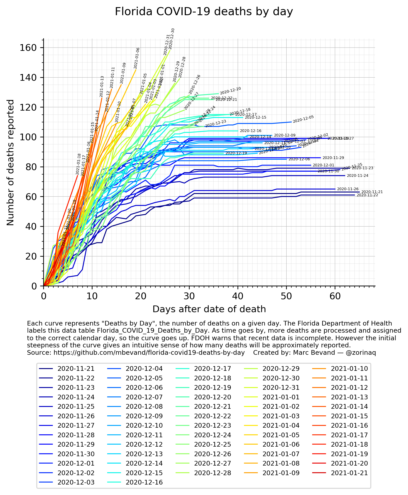
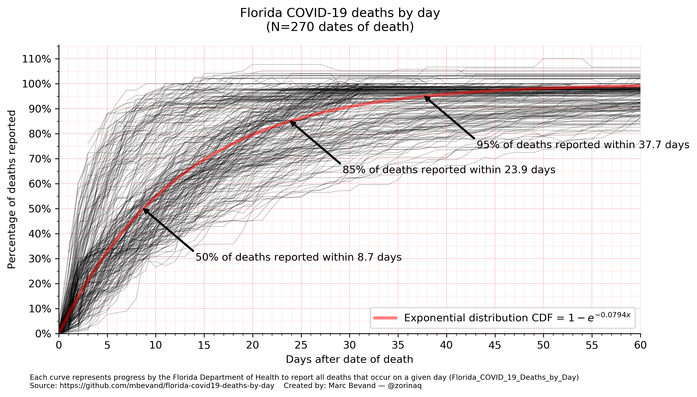
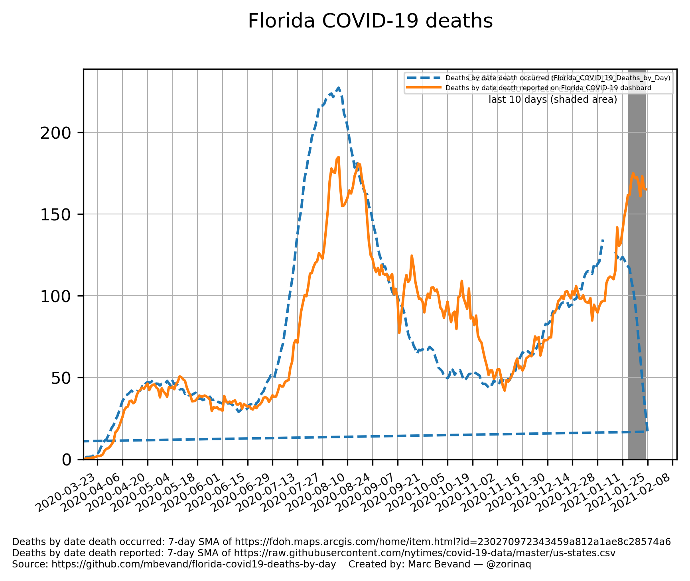

The Florida Department of Health (FDOH) provides COVID-19 *deaths by day* data
in the [`Florida_COVID_19_Deaths_by_Day`][tbl] table. Unlike the state's
[COVID-19 dashboard][dash], which reports deaths by *date of report*, *deaths
by day* represent the number of deaths by exact date of death, based on death
certificate information.

*Deaths by day* is more useful than deaths by date reported, however the former
is very incomplete due to inherent bureaucratic delays in processing deaths
certificates. For example the last 10 days always show a "permanent dip," which
is very often misinterpreted as decreasing deaths.

This repository provides daily archives of *deaths by day* data, and scripts to
analyze the completeness and reporting delays of this data.

## "Rainbow" chart



Each curve on the above chart, created by the script [chart_rainbow](chart_rainbow),
shows the number of deaths that occurred on a given day. As time goes by, more death
certificates are processed and more deaths are assigned to the correct calendar
day, so the curve goes up. The initial steepness of the curve gives an intuitive sense
of how many deaths will be approximately reported, despite the data being incomplete.
The leftmost curves are expected to establish new record-high numbers of deaths.

## Average reporting delay



This chart, created by the script [chart_average_reporting_delay](chart_average_reporting_delay),
shows the average reporting delay, and fits an exponential distribution. We see that, on average:

* 50% of deaths are reported within 4 days
* 85% of deaths are reported within 10 days
* 95% of deaths are reported within 16 days

The exponential distribution gives the proportion of deaths that are expected to have been
reported by *x* days:

*1 - e<sup>-0.1864x</sup>*

## Deaths occurred vs deatsh reported



This chart, created by the script [chart_deaths_occurred_vs_reported](chart_deaths_occurred_vs_reported),
shows the reporting lag. **Deaths by date of death are always higher than deaths by date
of report in periods of increasing deaths** (because of the lag.)

## Fetching "deaths by day"

The CSV files in this repository are daily archives of the
[`Florida_COVID_19_Deaths_by_Day`][tbl] table. FDOH appears to update the table
once a day around 10am-11am Eastern time.

The [download](download) Python script automatically downloads the table, converts it from
JSON to CSV format, and saves it as `deathsbydateexport_YYYYMMDD.csv`. The columns are:

* `Date`: milliseconds since UNIX Epoch time
* `Deaths`: number of deaths on this date
* `ObjectId`: unknown—not important

If for whatever reason you want to download the table without using the script:

1. Browse [`Florida_COVID_19_Deaths_by_Day`][tbl]
1. Click on [View](https://services1.arcgis.com/CY1LXxl9zlJeBuRZ/arcgis/rest/services/Florida_COVID_19_Deaths_by_Day/FeatureServer)
1. Click on table [Florida_COVID_19_Deaths_by_Day](https://services1.arcgis.com/CY1LXxl9zlJeBuRZ/ArcGIS/rest/services/Florida_COVID_19_Deaths_by_Day/FeatureServer/0)
1. Click on [Query](https://services1.arcgis.com/CY1LXxl9zlJeBuRZ/ArcGIS/rest/services/Florida_COVID_19_Deaths_by_Day/FeatureServer/0/query)
1. Type:
   ```
   Where: ObjectId>0
   Result type: standard  (although seems to work with none too)
   Out Fields: *
   Format: JSON
   ```
1. Click [Query (GET)](https://services1.arcgis.com/CY1LXxl9zlJeBuRZ/ArcGIS/rest/services/Florida_COVID_19_Deaths_by_Day/FeatureServer/0/query?where=ObjectId%3E0&objectIds=&time=&resultType=none&outFields=*&returnIdsOnly=false&returnUniqueIdsOnly=false&returnCountOnly=false&returnDistinctValues=false&cacheHint=false&orderByFields=&groupByFieldsForStatistics=&outStatistics=&having=&resultOffset=&resultRecordCount=&sqlFormat=none&f=pjson&token=)
1. The above URL returns the data in JSON format

## Community effort to archive FDOH data

I would like to encourage you to visit [FLDoH Data Sharing Links](https://docs.google.com/document/d/1BhXjwkwZTbuLhoNidd7FVvrynuzR_EZdV_TXe9zBRj0/edit), a community effort archiving other datasets from FDOH.

[tbl]: https://fdoh.maps.arcgis.com/home/item.html?id=230270972343459a812a1ae8c28574a6
[dash]: https://experience.arcgis.com/experience/96dd742462124fa0b38ddedb9b25e429
